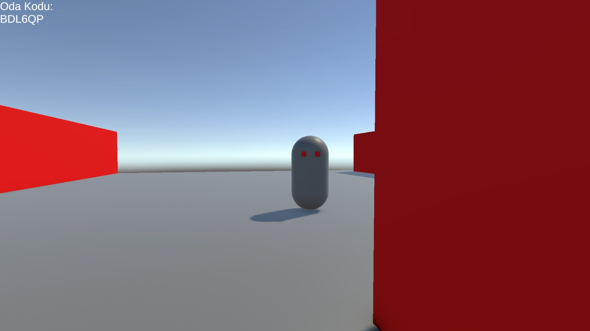
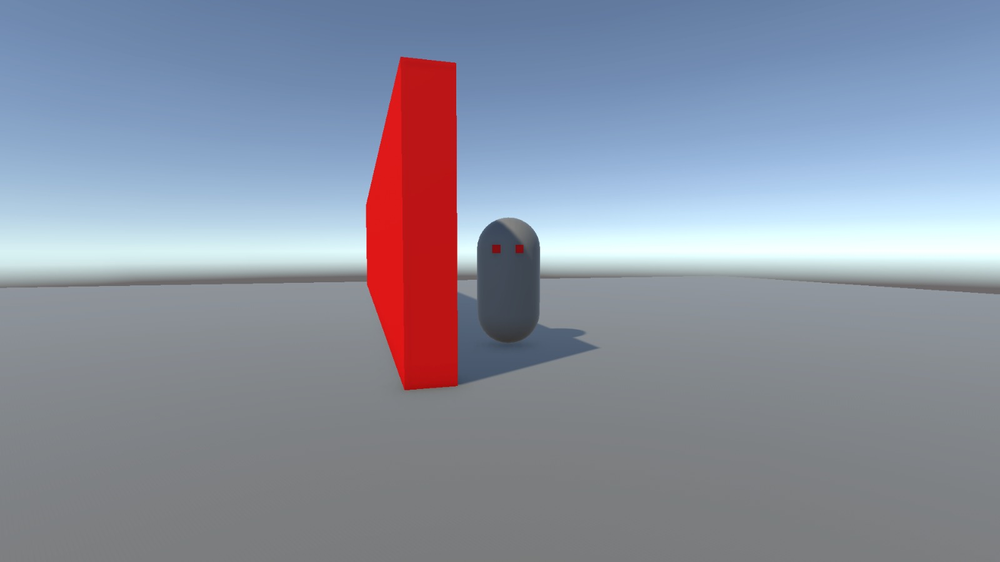

# 🎯 Multiplayer Shooter Prototype (Networking Research)

**Overview**
This project is a foundational multiplayer shooter prototype developed specifically to research and understand network programming in Unity. The primary goal was to explore Client-Server architectures, state synchronization, and Remote Procedure Calls (RPCs) rather than creating a fully commercial game.

It serves as a technical sandbox to test how data moves between players in real-time.

---

## 📸 Screenshots & Visuals

> *Replace these placeholders with your actual screenshots (e.g., showing two separate game windows side-by-side).*

| Client A (Host) | Client B (Joined Player) |
|:---:|:---:|
|  |  |
| *Player hosting the local server/room.* | *Player connected and synchronized.* |

---

## 🛠️ Technical Stack & Architecture

- **Engine:** Unity 2022+ 
- **Language:** C#
- **Networking Solution:** Networking Solution: Unity Netcode for GameObjects (NGO)
- **Architecture:** Client-Host topology.

---

## 🎮 Key Research Areas & Features

### 1. Transform Synchronization
- Implemented network transforms to smoothly interpolate player positions and rotations across the network, compensating for latency and packet loss.

### 2. Remote Procedure Calls (RPCs)
- Utilized RPCs for critical gameplay events (e.g., shooting bullets, applying damage). 
- Separated logic into `ServerRpc` (commands sent from client to server) and `ClientRpc` (broadcasts from server to all clients).

### 3. State Management & Variables
- Used network variables to sync player health and score, ensuring that UI updates consistently for all connected clients when the state changes.

### 4. Spawning & Lobby Mechanics
- Created a basic connection flow allowing players to host a room or join an existing session.
- Managed networked object spawning so that instantiated objects (like bullets or players) exist universally in the network.

---

## 🚀 How to Run & Test

To test the multiplayer synchronization locally:
1. Clone the repository and open it in Unity.
2. Go to **File > Build Settings** and create a standalone Windows/Mac build.
3. Run the compiled `.exe` (or `.app`) file to open the first instance.
4. Press the **Play** button within the Unity Editor to open the second instance.
5. In one instance, click **Host / Create Room**.
6. In the other instance, click **Join / Connect**.
7. Move around and shoot to observe real-time synchronization between the two windows.

---

## 📝 Author & Academic Context
Developed by **[Burak ABANOZ]** as part of an independent research project to master multiplayer game development mechanics and network infrastructure. Includes components documented in the project's online multiplayer research report.
